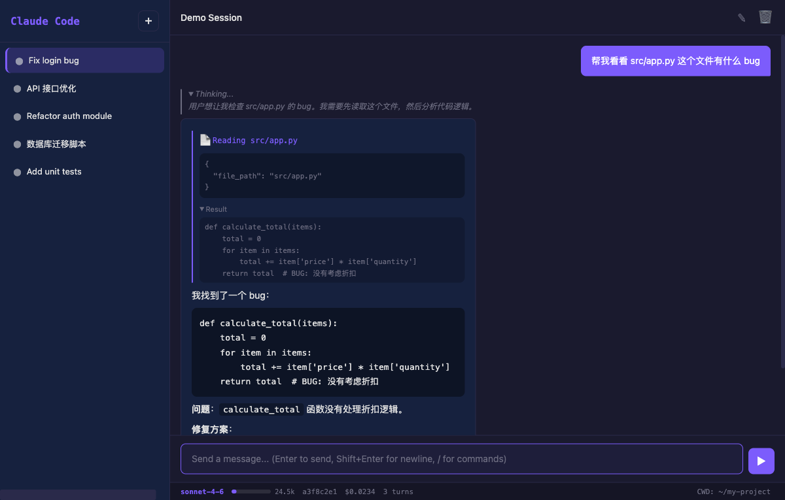
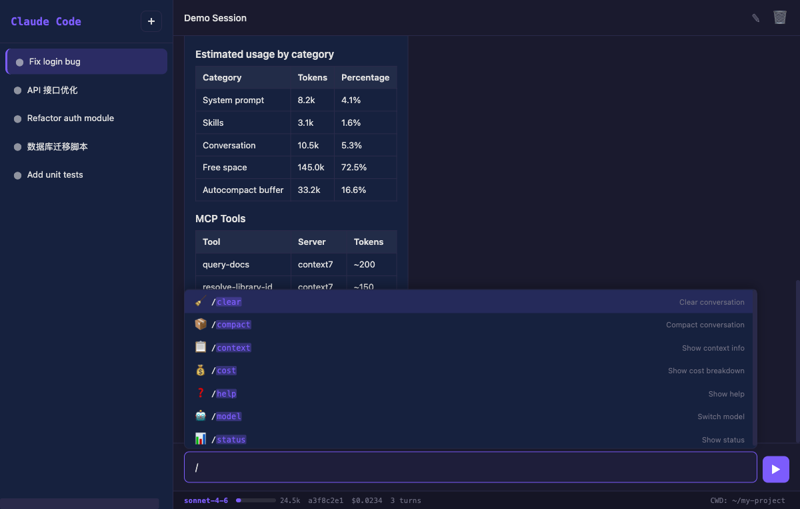
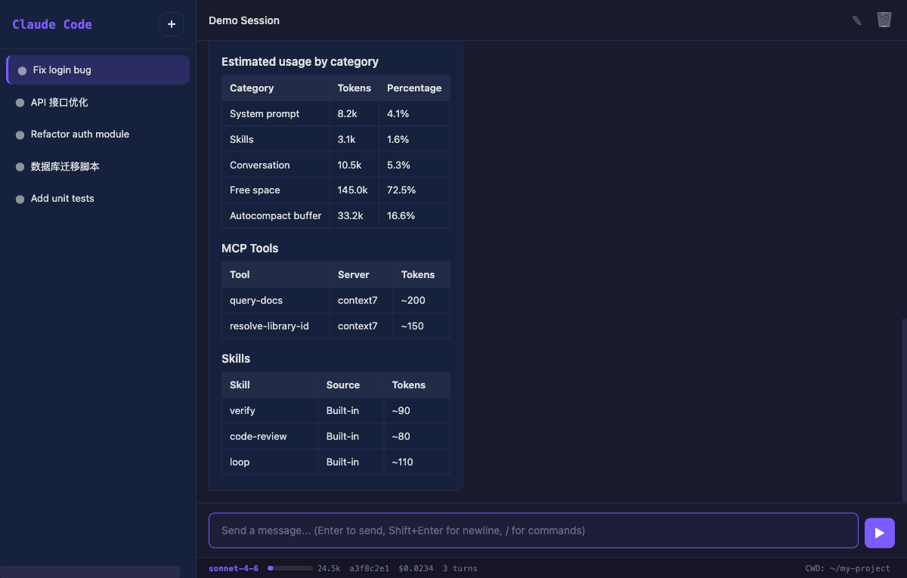

# Claude Code Web UI

A browser-based web interface for [Claude Code](https://docs.anthropic.com/en/docs/claude-code). Uses the Claude Agent SDK + CLI as the backend, providing a full-featured chat UI with session management, streaming responses, tool call visualization, and slash command support.



## Features

### Chat with Streaming

Messages are sent to the Claude Agent SDK via WebSocket and streamed back in real-time. As Claude generates a response, text appears incrementally — no waiting for the full reply.

- **Real-time streaming** via WebSocket — text chunks (`text_delta`) are appended to the message as they arrive
- **Markdown rendering** with [marked.js](https://marked.js.org/) — headers, lists, tables, bold/italic, links, and inline code all render correctly
- **Syntax highlighting** with [highlight.js](https://highlightjs.org/) — code blocks are language-detected and highlighted with the GitHub Dark theme
- **Code block copy buttons** — every `<pre>` block gets a "Copy" button in the top-right corner
- **Extended thinking** — when Claude uses extended thinking, the thinking content appears in a collapsible "Thinking..." block above the response, open by default

### Tool Call Visualization

When Claude uses tools (reading files, running commands, searching code, etc.), each tool call is displayed inline in the chat with full details:

- **Icon + description** — each tool shows a recognizable icon and a human-readable summary (e.g., "Reading server.py", "Running: npm test")
- **Collapsible input** — click the tool header to expand and see the raw JSON input (file path, command, search query, etc.)
- **Collapsible output** — tool results appear in an expandable "Result (click to expand)" block below the tool call
- **Error highlighting** — tool errors are shown with a red "Error (click to expand)" label
- **Result truncation** — outputs longer than 2000 characters are truncated with "..." to keep the UI manageable

Supported tools: Read, Write, Edit, Bash, Glob, Grep, Agent (sub-agent), WebFetch, WebSearch, TodoRead, TodoWrite, NotebookEdit. Unknown tools display as "Using {tool_name}" with a generic gear icon.

### Session Management

Sessions are independent conversation threads. Each session maintains its own context, message history, and SDK session ID.

- **Multiple sessions** — create, switch, and delete sessions from the sidebar
- **Session rename** — double-click a session name in the sidebar to rename it inline (Enter to confirm, Esc to cancel). You can also use the pencil icon in the chat header.
- **Session history persistence** — when you switch to a session, its full message history is loaded from the SDK (including text, thinking blocks, and tool calls). History survives page refreshes.
- **Interrupt/stop** — click the "Stop" button (or press `Esc`) while Claude is responding to cancel the running query. The backend cancels the async task and sends an "Interrupted" result.
- **SDK session mapping** — each UI session maps to an SDK session ID. The first message in a session triggers SDK session creation; subsequent messages resume the same SDK session for full context continuity.

### Slash Commands

Type `/` in the input field to open an autocomplete menu of available commands. Commands are routed through three tiers:

1. **Local commands** (handled entirely in the browser, instant response):
   - `/clear` — clear the message display
   - `/help` — show available commands and keyboard shortcuts
   - `/status` — show model, session, tokens, cost, turns, CWD
   - `/model` — show the current model name
   - `/config` — show full configuration (model, CWD, permission mode, tools, MCP servers)
   - `/permissions` — show current permission mode

2. **CLI commands** (executed via `claude -p`, returns formatted output):
   - `/context` — show context window usage with rendered markdown tables
   - `/cost` — show cost breakdown
   - `/usage` — show token usage statistics
   - `/compact` — compact the conversation to reduce context
   - `/heapdump` — generate a heap dump for debugging
   - `/init`, `/review`, `/debug`, `/verify`, `/code-review`, `/security-review` — various Claude Code commands
   - `/batch`, `/loop`, `/run`, `/claude-api`, `/insights`, `/goal`, `/update-config`, `/fewer-permission-prompts`, `/run-skill-generator`, `/team-onboarding`

3. **SDK commands** (fallback — sent as regular messages through the WebSocket to the Claude Agent SDK):
   - Any unrecognized slash command is forwarded to Claude as a message

The command list is initially hardcoded but gets **dynamically replaced** when the SDK sends its `init` message with the actual `slash_commands` list. This ensures the autocomplete menu always reflects the commands your Claude Code version actually supports.



### Context & Status

The status bar at the bottom of the chat shows live session information:

| Indicator | Description |
|-----------|-------------|
| **Model** | Current model name (e.g., "sonnet-4-6", "opus-4-7") |
| **Context bar** | Visual progress bar showing context window usage. Turns yellow at 60%, red at 80%. Hover for token count. |
| **Session ID** | First 8 characters of the current session UUID |
| **Cost** | Running cost in USD for the current session |
| **Turns** | Number of conversation turns in the current session |
| **CWD** | Current working directory — click to open the CWD dialog and change it |

Token counts (`input_tokens` / `output_tokens`) are updated in real-time from WebSocket `usage` events. Cost and turns are updated from the `result` message at the end of each response.

The `/context` command (via CLI) returns rich markdown tables showing context window breakdown:



### ANSI Color Rendering

CLI command output (from `/context`, `/cost`, `/heapdump`, etc.) may contain ANSI escape codes for colored terminal output. The web UI includes a built-in ANSI-to-HTML converter that:

- Renders **standard colors** (30-37, 90-97) and **background colors** (40-47, 100-107)
- Supports **256-color** (`38;5;n`) and **RGB** (`38;2;r;g;b`) extended color modes
- Handles **bold**, *italic*, and <u>underline</u> text attributes
- Supports **reverse video** (swap foreground/background)
- Auto-detects ANSI vs plain text — if the output contains no escape codes, it renders as standard markdown instead

### `@file` Mentions

Type `@` followed by a filename to get file path autocomplete from the current working directory:

- **Directory navigation** — type `@src/` to browse into subdirectories; the autocomplete shows folders (📁) and files (📄)
- **Path insertion** — selecting a file inserts its relative path (e.g., `@src/server.py `); selecting a directory appends `/` for continued navigation
- **Live file listing** — powered by the `/api/files` endpoint which reads the actual filesystem (skipping dotfiles, limited to 50 entries)

### Input History

Your sent messages are saved to `localStorage` (up to 200 entries) and can be recalled:

- **Up arrow** — cycle backward through previous messages (when the input is empty or already navigating history)
- **Down arrow** — cycle forward to more recent messages
- **Draft preservation** — your current input is saved as a draft when you start navigating; pressing Down past the last history item restores it

History persists across page refreshes but is stored per-browser (not per-session).

### CWD (Working Directory)

The working directory determines where Claude Code reads/writes files and runs commands:

- **Click "CWD: ..."** in the status bar to open the CWD dialog
- **Type a path** (supports `~` expansion) and click "Set" to change it
- **Affects all sessions** — changing CWD applies to new queries in all sessions
- **Default** — starts at `$HOME`

### Keyboard Shortcuts

| Key | Action |
|-----|--------|
| `Enter` | Send message |
| `Shift+Enter` | New line in input |
| `Escape` | Stop running query / close autocomplete menu |
| `/` | Focus input and open slash command menu (when input is not focused) |
| `Up/Down` | Browse input history |
| `Ctrl+N` (`Cmd+N` on Mac) | Create new session |
| `Ctrl+L` (`Cmd+L` on Mac) | Clear message display (does not delete history) |

### Dark Theme

The entire UI uses a dark theme built with CSS custom properties (`--bg`, `--surface`, `--text`, `--accent`, etc.). All components — sidebar, chat bubbles, tool blocks, code blocks, dialogs, and the status bar — are styled consistently. The highlight.js theme is `github-dark` to match.

## Prerequisites

- Python 3.10+
- [Claude Code CLI](https://docs.anthropic.com/en/docs/claude-code) installed and authenticated (`claude` command available)

## Quick Start

```bash
git clone https://github.com/alloevil/claude-web-ui.git
cd claude-web-ui
bash start.sh
```

Then open **http://localhost:8080** in your browser.

## Manual Setup

```bash
pip install -r requirements.txt
uvicorn server:app --reload --port 8080 --host 0.0.0.0
```

## Architecture

```
Browser (HTML/JS/CSS)
    │ WebSocket
    ▼
FastAPI Backend (server.py)
    │
    ├── Claude Agent SDK (query, sessions)
    └── Claude CLI (claude -p) for slash commands
```

- **Backend**: `server.py` — FastAPI with WebSocket endpoint, REST API, CLI bridge
- **Frontend**: `static/` — vanilla HTML/CSS/JS, no build step
- **SDK**: `claude-agent-sdk` for chat sessions with streaming
- **CLI**: `claude -p --output-format json` for slash commands

### Data Flow

```
User types message → app.js → WebSocket JSON → server.py
  → claude_agent_sdk.query(prompt, options) → async generator
  → StreamEvent/AssistantMessage/ResultMessage → _forward_message()
  → WebSocket JSON → app.js → DOM rendering (markdown via marked.js, syntax via highlight.js)
```

### Command Routing

```
Slash command entered
  ├─ /clear, /help, /status, /model, /config, /permissions
  │    → Handled locally in app.js (instant)
  ├─ /context, /cost, /usage, /compact, /heapdump, etc.
  │    → POST /api/cli-command → claude -p → JSON response → rendered
  └─ Unknown command
       → Sent as regular message via WebSocket → Claude Agent SDK
```

## API Endpoints

| Method | Path | Description |
|--------|------|-------------|
| `GET` | `/api/sessions` | List all sessions with metadata (name, created_at, summary) |
| `POST` | `/api/sessions` | Create a new session (returns UUID) |
| `DELETE` | `/api/sessions/{id}` | Delete a session and its SDK mapping |
| `GET` | `/api/sessions/{id}/messages` | Get full session message history from SDK |
| `POST` | `/api/sessions/{id}/rename` | Rename a session (stored in-memory) |
| `POST` | `/api/sessions/{id}/interrupt` | Cancel a running query task |
| `POST` | `/api/cli-command` | Execute a Claude Code CLI command (`claude -p`) |
| `GET` | `/api/status` | Get runtime status (model, tools, version, MCP servers) |
| `GET` | `/api/config` | Get current configuration (CWD) |
| `POST` | `/api/config/cwd` | Set the working directory |
| `GET` | `/api/files` | List files/dirs for `@` mention autocomplete |

## WebSocket Protocol

Connect to `ws://localhost:8080/ws/{session_id}`. Send JSON messages:

**Client → Server:**

| Type | Fields | Description |
|------|--------|-------------|
| `message` | `content: string` | Send a user message to Claude |
| `rename` | `name: string` | Rename the session |

**Server → Client:**

| Type | Fields | Description |
|------|--------|-------------|
| `text_delta` | `content: string` | Incremental text content chunk |
| `thinking` | `content: string` | Extended thinking content chunk |
| `tool_use_start` | `tool_id, name` | Tool invocation started (input arrives later) |
| `tool_use` | `tool_id, name, input` | Tool invocation with full input JSON |
| `tool_result` | `tool_use_id, content, is_error` | Tool output (may be truncated) |
| `result` | `result, cost, turns, subtype, is_error` | Final message with cost/turns metadata |
| `usage` | `input_tokens, output_tokens` | Token count update |
| `system` | `subtype, data` | System event (init data: model, tools, commands, etc.) |
| `session_ready` | `session_id, old_session_id` | SDK session ID assigned on first query |
| `error` | `message` | Error message |

## Project Structure

```
├── server.py           # FastAPI backend (WebSocket, REST API, CLI bridge)
├── requirements.txt    # Python dependencies (fastapi, uvicorn, claude-agent-sdk)
├── start.sh            # Quick start script (install deps + start server)
├── CLAUDE.md           # Claude Code project instructions
├── static/
│   ├── index.html      # Main page layout (sidebar, chat, CWD dialog)
│   ├── app.js          # All frontend logic (~1400 lines)
│   └── style.css       # Dark theme with CSS custom properties
└── screenshots/        # README images
    ├── chat.png        # Main chat interface
    ├── autocomplete.png # Slash command autocomplete
    └── context.png     # /context command output
```

## License

MIT
