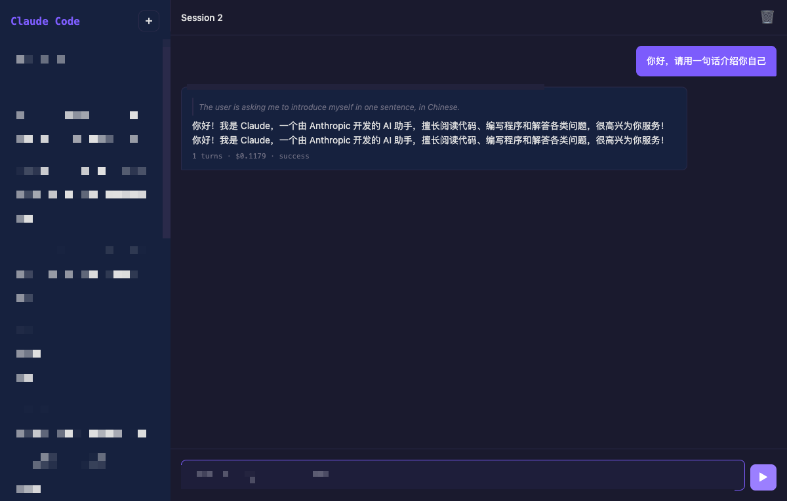

# Claude Code Web UI

A local web interface for [Claude Code](https://docs.anthropic.com/en/docs/claude-code), Anthropic's agentic coding tool. Chat with Claude Code through a browser with streaming responses, session management, and tool call visualization.



## Features

- **Real-time streaming** - See Claude's responses as they're generated
- **Session management** - Create, switch, and delete conversation sessions
- **Tool visualization** - Collapsible blocks showing tool calls (Read, Write, Bash, Edit, etc.) with inputs and results
- **History** - Browse past conversations with full context
- **Session persistence** - Conversations persist via Claude Code's built-in session store
- **Zero build step** - Vanilla HTML/CSS/JS frontend, no Node.js or bundler required

## Prerequisites

- Python 3.10+
- [Claude Code CLI](https://docs.anthropic.com/en/docs/claude-code) installed and authenticated (`claude` command available)

## Quick Start

```bash
git clone https://github.com/alloevil/claude-web-ui.git
cd claude-web-ui
bash start.sh
```

Then open **http://localhost:8080** in your browser.

## Manual Setup

```bash
pip install -r requirements.txt
uvicorn server:app --reload --port 8080
```

## Architecture

```
Browser (HTML/JS/CSS)
   │
   │ WebSocket (streaming JSON)
   ▼
FastAPI Backend (Python)
   │
   │ claude_agent_sdk
   ▼
Claude Code Agent SDK
```

The backend uses the [Claude Agent SDK](https://docs.anthropic.com/en/docs/claude-code/sdk) Python package to interact with Claude Code. Messages stream from the SDK through FastAPI WebSockets to the browser in real-time.

## Configuration

The server runs on port 8080 by default. To change it:

```bash
uvicorn server:app --port 3000
```

## Project Structure

```
├── server.py           # FastAPI backend: WebSocket + REST API
├── requirements.txt    # Python dependencies
├── start.sh            # Quick start script
└── static/
    ├── index.html      # Main page
    ├── style.css       # Styling (dark theme)
    └── app.js          # Frontend logic
```

## API Endpoints

| Method | Path | Description |
|--------|------|-------------|
| `GET` | `/api/sessions` | List all sessions |
| `POST` | `/api/sessions` | Create a new session |
| `DELETE` | `/api/sessions/{id}` | Delete a session |
| `GET` | `/api/sessions/{id}/messages` | Get session message history |
| `WS` | `/ws/{session_id}` | WebSocket for real-time chat |

## WebSocket Protocol

Messages from server to client:

```json
{"type": "text", "content": "Hello..."}
{"type": "text_delta", "content": " world"}
{"type": "tool_use", "tool_id": "...", "name": "Read", "input": {"file_path": "..."}}
{"type": "tool_result", "tool_use_id": "...", "content": "...", "is_error": false}
{"type": "result", "result": "...", "cost": 0.001, "turns": 3}
{"type": "error", "message": "..."}
```

## License

MIT
